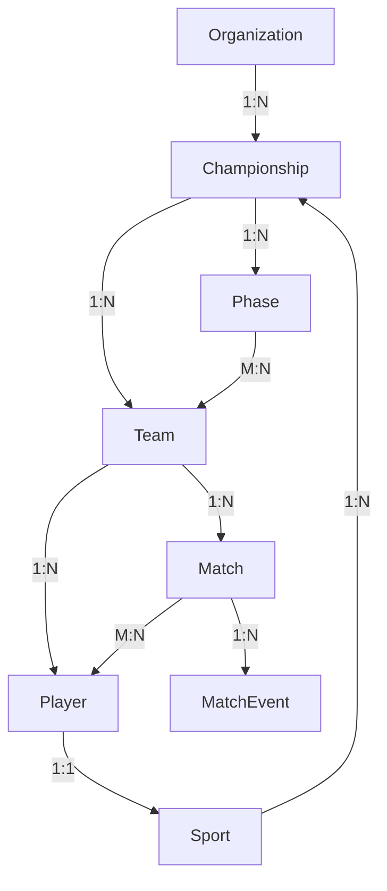

# Casos de Uso y Servicios - IcePlay Front

Documentación completa de los casos de uso identificados en los modelos de entidades y los servicios correspondientes.

---

## 📋 Tabla de Contenidos

1. [Organization](#organization)
2. [Sport Config](#sport-config)
3. [Championship](#championship)
4. [Phase](#phase)
5. [Team](#team)
6. [Player](#player)
7. [Match Rules](#match-rules)
8. [Social Links](#social-links)
9. [Servicios Disponibles](#servicios-disponibles)

---

## Organization

### Entidad Principal

```typescript
export interface Organization {
  id: string;
  name: string;
  slug: string;
  description?: string;
  logo?: string;
  coverImage?: string;
  contactEmail: string;
  contactPhone?: string;
  address?: string;
  city?: string;
  country: string;
  website?: string;
  socialLinks?: OrganizationSocialLinks;
  settings?: OrganizationSettings;
  createdAt: Date;
  updatedAt: Date;
  isActive: boolean;
}
```

### Casos de Uso

| UC | Descripción | DTO | Notas |
|---|---|---|---|
| **UC: Crear organización** | UC: Crear una nueva organización con su primer administrador | `CreateOrganizationDto` | Se crea la organización y se provisiona al primer admin en una sola llamada |
| **UC: Listar organizaciones** | UC: Obtener todas las organizaciones accesibles | - | Filtrable por status, búsqueda por nombre |
| **UC: Ver detalle de organización** | UC: Obtener información completa de una organización | - | Incluye settings, redes sociales, contactos |
| **UC: Editar organización** | UC: Actualizar información básica (nombre, logo, contacto, etc.) | `UpdateOrganizationDto` | Campos opcionales para actualización parcial |
| **UC: Configurar organización** | UC: Actualizar settings (deporte por defecto, zona horaria, locale, colores) | `OrganizationSettings` | Afecta a todos los campeonatos de la organización |
| **UC: Ver estadísticas** | UC: Obtener conteo de campeonatos, admins y campeonatos activos | `OrganizationWithStats` | Response extendida con campos calculados |

### DTOs

- **CreateOrganizationDto**: `name`, `contactEmail`, `country`, `city?`, `adminEmail`, `adminFirstName`, `adminLastName`
- **UpdateOrganizationDto**: `name?`, `description?`, `logo?`, `contactEmail?`, `contactPhone?`, `address?`, `city?`, `website?`, `socialLinks?`, `settings?`

### Servicio Asociado

**Service**: `OrganizationService`

```typescript
getOrganizations(): Observable<Organization[]>
getOrganizationById(id: string): Observable<Organization>
createOrganization(org: Omit<Organization, 'id'>): Observable<Organization>
updateOrganization(id: string, org: Partial<Organization>): Observable<Organization>
```

**Endpoints**:
- `GET /organizations` - Listar todas
- `GET /organizations/{id}` - Obtener por ID
- `POST /organizations` - Crear nueva
- `PATCH /organizations/{id}` - Actualizar

---

## Sport Config

### Entidades Principales

```typescript
export interface Sport {
  id: number;
  name: string;
  icon: string;
  periods: number;
  periodDuration: number;
  periodLabel: string;
  periodLabelPlural: string;
  matchTypeSingular: string;
  matchTypePlural: string;
  positions?: Position[];
  matchEventTypes?: TypeMatchEvent[];
  matchRules?: MatchRule[];
}
```

### Position (Catálogo Global)

```typescript
export interface Position {
  id: number;
  code: string;         // 'GK', 'FW', 'MF', 'DF'
  label: string;        // 'Portero', 'Delantero'
  abbreviation: string; // 'POR', 'DEL'
}
```

### TypeMatchEvent (Catálogo Global)

```typescript
export interface TypeMatchEvent {
  id: number;
  label: string;        // 'Gol', 'Tarjeta amarilla'
  icon: string;
  color: string;
  matchPoint: number;   // Puntos que suma al marcador
  category: MatchEventCategory;
  standingPoints: number; // Puntos de tabla
}
```

### MatchRule (Catálogo Global)

```typescript
export interface MatchRule {
  id: number;
  name: string;  // 'max_players', 'max_yellow_cards'
  value: number; // Valor default del sistema
}
```

### Casos de Uso

| UC | Descripción | DTO |
|---|---|---|
| **UC: Listar deportes** | UC: Obtener deportes disponibles (selector en form de creación de campeonato) | - |
| **UC: Ver detalle de deporte** | UC: Obtener deporte completo con todas sus posiciones, eventos y reglas | `SportDetail` |
| **UC: Config de partido** | UC: Obtener configuración compacta de deporte para el motor de partidos | `SportMatchConfig` |
| **UC: Crear deporte** | UC: Crear nuevo deporte (operación administrativa muy infrecuente) | `CreateSportDto` |
| **UC: Actualizar deporte** | UC: Ajustar labels o duración de periodo | `UpdateSportDto` |
| **UC: Agregar posición** | UC: Asociar posición existente a un deporte | `AddSportPositionDto` |
| **UC: Agregar evento** | UC: Asociar tipo de evento a un deporte | `AddSportTypeMatchEventDto` |
| **UC: Agregar regla** | UC: Asociar regla de partido a un deporte | `AddSportMatchRuleDto` |

### DTOs

- **CreateSportDto**: `name`, `icon`, `periods`, `periodDuration`, `periodLabel`, `periodLabelPlural`, `matchTypeSingular`, `matchTypePlural`
- **UpdateSportDto**: Partial de `CreateSportDto` (sin `name`)
- **AddSportPositionDto**: `positionId`
- **AddSportTypeMatchEventDto**: `typeMatchEventId`
- **AddSportMatchRuleDto**: `matchRuleId`

### Servicio Asociado

**Service**: `SportService`

```typescript
getAll(): Observable<SportOption[]>
getById(id: number): Observable<SportOption | null>
```

**Endpoints**:
- `GET /sports` - Listar deportes disponibles
- `GET /sports/{id}` - Obtener deporte por ID

**Notas**: 
- Los deportes son un catálogo que cambia muy rara vez
- Son candidatos para caché con TTL largo
- Actualmente usa localStorage como MOCK

---

## Championship

### Entidad Principal

```typescript
export interface Championship {
  id: number;
  organizationId: number;
  sportId: number;
  name: string;
  slug: string;
  description: string | null;
  season: string;
  logo: string | null;
  status: ChampionshipStatus;
  registrationStartDate: Date | null;
  registrationEndDate: Date | null;
  startDate: Date | null;
  endDate: Date | null;
  maxTeams: number;
  maxPlayersPerTeam: number;
  createdAt: Date;
  updatedAt: Date;
}
```

### Estados del Championship

```typescript
export enum ChampionshipStatus {
  Draft        = 'draft',        // Creado, sin publicar
  Registration = 'registration', // Abierto a inscripciones
  Active       = 'active',       // Campeonato en curso
  Finished     = 'finished',     // Finalizado
  Cancelled    = 'cancelled',    // Cancelado
}
```

### Casos de Uso

| UC | Descripción | DTO | Notas |
|---|---|---|---|
| **UC: Crear campeonato** | UC: Crear nuevo campeonato en estado Draft | `CreateChampionshipDto` | Se crea con organizationId, sportId y configuración básica |
| **UC: Listar campeonatos** | UC: Obtener campeonatos con filtros (organización, deporte, estado, temporada) | `ChampionshipFiltersDto` | Paginado, sin relaciones profundas |
| **UC: Ver detalle campeonato** | UC: Obtener información completa incluyendo fases, equipos, estadísticas | `ChampionshipDetail` | Incluye todas las relaciones necesarias |
| **UC: Editar campeonato** | UC: Actualizar información básica (nombre, logo, descripción, limites) | `UpdateChampionshipDto` | Campos opcionales |
| **UC: Cambiar estado** | UC: Transición de estado: draft → registration → active → finished | `UpdateChampionshipStatusDto` | Transiciones validadas linealmente |
| **UC: Ver reglas** | UC: Obtener todas las reglas configuradas del campeonato | - | Incluye valor default y override del campeonato |
| **UC: Configurar reglas** | UC: Crear o actualizar calor de una regla específica | `CreateChampionshipMatchRuleDto` | Override del valor default por deporte |
| **UC: Ver standings** | UC: Obtener tabla de posiciones de una fase | - | Calculado desde MatchEvent × TypeMatchEvent |
| **UC: Agregar red social** | UC: Asociar link de red social al campeonato | `CreateSocialLinkDto` | Facebook, Instagram, Twitter, YouTube |
| **UC: Editar red social** | UC: Actualizar link de red social | `UpdateSocialLinkDto` | - |

### DTOs

- **CreateChampionshipDto**: `organizationId`, `sportId`, `name`, `slug`, `description?`, `season`, `logo?`, `maxTeams`, `maxPlayersPerTeam`
- **UpdateChampionshipDto**: `name?`, `description?`, `logo?`, `maxTeams?`, `maxPlayersPerTeam?`
- **UpdateChampionshipStatusDto**: `status`
- **ChampionshipFiltersDto**: `organizationId?`, `sportId?`, `status?`, `season?`, `search?`, `page?`, `limit?`
- **CreateSocialLinkDto**: `socialNetworkId`, `link`
- **UpdateSocialLinkDto**: `link?`

### Response Types

- **ChampionshipListItem**: Campos planos para listados
- **ChampionshipDetail**: Incluye fases, equipos, reglas, redes sociales
- **ChampionshipRulesResponse**: Lista de reglas con defaults y overrides
- **PhaseStandingsResponse**: Tabla de posiciones materializada

### Servicio Asociado

**Service**: `ChampionshipService`

```typescript
getAll(filters?: ChampionshipFiltersDto): Observable<PaginatedChampionships>
getById(id: string): Observable<ChampionshipDetail>
create(championship: CreateChampionshipDto): Observable<Championship>
update(id: string, championship: UpdateChampionshipDto): Observable<Championship>
updateStatus(id: string, status: UpdateChampionshipStatusDto): Observable<Championship>
getRules(id: string): Observable<ChampionshipRulesResponse>
updateRule(id: string, rule: CreateChampionshipMatchRuleDto): Observable<void>
```

**Endpoints**:
- `GET /championships` - Listar con filtros
- `GET /championships/{id}` - Obtener detalle
- `POST /championships` - Crear
- `PATCH /championships/{id}` - Actualizar
- `PATCH /championships/{id}/status` - Cambiar estado
- `GET /championships/{id}/rules` - Obtener reglas
- `POST /championships/{id}/rules` - Configurar regla

**Notas**: Actualmente usa localStorage como MOCK

---

## Phase

### Entidad Principal

```typescript
export interface Phase {
  id: number;
  championshipId: number;
  type: PhaseType;      // league | knockout | groups | swiss
  status: PhaseStatus;  // pending | active | finished
  name: string;
  order: number;
  description?: string;
  startDate: Date | null;
  endDate: Date | null;
  createdAt: Date;
  updatedAt: Date;
}
```

### Subtipos de Configuración

```typescript
export interface PhaseLeagueConfig {
  phaseId: number;
  matchesPerTeam: number;      // Cuántos partidos juega cada equipo
}

export interface PhaseKnockoutConfig {
  phaseId: number;
  legs: number;                // 1 = ida y vuelta, 2 = solo ida
  promotedCount: number;       // Cuántos equipos avanzan
}

export interface PhaseGroupsConfig {
  phaseId: number;
  groupsCount: number;
  teamsPerGroup: number;
  format: string;              // Ej: "1x1", "3x3"
}

export interface PhaseSwissConfig {
  phaseId: number;
  rounds: number;
  pointsPerWin: number;
}
```

### Casos de Uso

| UC | Descripción | DTO | Config Asociada |
|---|---|---|---|
| **UC: Crear fase Liga** | UC: Crear fase Round-Robin / todos contra todos | `CreatePhaseDto` + config | `PhaseLeagueConfig` |
| **UC: Crear fase Eliminación** | UC: Crear fase de eliminación directa | `CreatePhaseDto` + config | `PhaseKnockoutConfig` |
| **UC: Crear fase Grupos** | UC: Crear fase de grupos clasificatoria | `CreatePhaseDto` + config | `PhaseGroupsConfig` |
| **UC: Crear fase Suiza** | UC: Crear fase con sistema suizo | `CreatePhaseDto` + config | `PhaseSwissConfig` |
| **UC: Listar fases** | UC: Obtener todas las fases de un campeonato | - | Ordenadas por `order` |
| **UC: Ver detalle fase** | UC: Obtener información completa con su configuración específica | - | Incluye grupos y partidos |
| **UC: Editar fase** | UC: Actualizar información básica y configuración | `UpdatePhaseDto` | - |
| **UC: Crear grupo** | UC: Agregar grupo dentro de una fase de grupos | `CreateGroupTeamDto` | Vincula equipos a grupos |

### DTOs

- **CreatePhaseDto**: `championshipId`, `type`, `name`, `order`, `startDate?`, `endDate?`, más campos específicos por tipo
- **UpdatePhaseDto**: `name?`, `description?`, `startDate?`, `endDate?`, más campos de configuración

---

## Team

### Entidad Principal

```typescript
export interface Team {
  id: number;
  championshipId: number;
  name: string;
  shortname: string;
  slug: string;
  logoUrl: string | null;
  documentUrl: string | null;
  primaryColor: string | null;
  secondaryColor: string | null;
  foundedYear: number | null;
  homeVenue: string | null;
  location: string | null;
  coachName: string | null;
  coachPhone: string | null;
  isActive: boolean;
  hasActiveMatches: boolean;
  createdAt: Date;
  updatedAt: Date;
  championship?: Pick<Championship, 'id' | 'name' | 'slug' | 'maxPlayersPerTeam'>;
  players?: Player[];
  groups?: TeamGroupTeam[];
}
```

### Pivot: Team ↔ GroupTeam

```typescript
export interface TeamGroupTeam {
  teamId: number;
  groupTeamId: number;
  groupTeam?: {
    id: number;
    order: number;
    name: string | null;
    phaseId: number;
    phaseName?: string;
    phaseType?: string;
  };
}
```

### Casos de Uso

| UC | Descripción | DTO | Validaciones |
|---|---|---|---|
| **UC: Inscribir equipo** | UC: Registrar equipo al campeonato durante la fase de inscripción | `CreateTeamDto` | Nombre único en campeonato, shortname único, logo validado |
| **UC: Listar equipos** | UC: Obtener equipos del campeonato con filtros (activos, con partidos, búsqueda) | `TeamFiltersDto` | Paginado, respuesta con `playerCount` materializado |
| **UC: Ver perfil equipo** | UC: Obtener detalle completo incluyendo jugadores, grupos y estadísticas | - | Respuesta tipo `TeamProfile` |
| **UC: Editar equipo** | UC: Actualizar datos básicos (nombre, logo, colores, cuerpo técnico) | `UpdateTeamDto` | Campos opcionales |
| **UC: Activar/Desactivar** | UC: Cambiar estado operacional del equipo | `UpdateTeamStatusDto` | Validar si tiene partidos activos |
| **UC: Asignar a grupo** | UC: Agregar equipo a un grupo de fase | `CreateTeamGroupTeamDto` | Validar que grupo pertenezca al campeonato |
| **UC: Ver estadísticas** | UC: Obtener stats en campeonato (PJ, G, E, P, GF, GC, Dif, Pts) | - | Materializado en tabla `Standing` |
| **UC: Importar CSV** | UC: Inscribir equipos y jugadores desde archivo CSV | `CsvImportResult` | Retorna conteos e importados y skipped |

### DTOs

- **CreateTeamDto**: `name`, `shortname`, `slug`, `logoUrl?`, `documentUrl?`, `primaryColor?`, `secondaryColor?`, `foundedYear?`, `homeVenue?`, `location?`, `coachName?`, `coachPhone?`
- **UpdateTeamDto**: Todos opcionales
- **UpdateTeamStatusDto**: `isActive`
- **TeamFiltersDto**: `isActive?`, `hasActiveMatches?`, `search?`, `page?`, `limit?`

### Response Types

- **TeamListItem**: Campos planos con `playerCount` materializado
- **TeamProfile**: Incluye jugadores, grupos y estadísticas
- **TeamStats**: `played`, `won`, `drawn`, `lost`, `goalsFor`, `goalsAgainst`, `goalDifference`, `points`

### Servicio Asociado

**Service**: `TeamService` + `TeamImportService`

```typescript
// TeamService
getTeams(championshipId: string): Observable<Team[]>
getTeamsByOrganization(organizationId: string): Observable<Team[]>
getTeamById(id: string): Observable<Team>
getTeamWithPlayers(id: string): Observable<TeamProfile>
createTeam(team: CreateTeamDto & {championshipId, organizationId}): Observable<Team>
updateTeam(id: string, team: UpdateTeamDto): Observable<Team>

// TeamImportService
importFromCsv(file: File, championshipId: string): Observable<CsvImportResult>
```

**Endpoints**:
- `GET /teams?championshipId={id}` - Listar por campeonato
- `GET /teams?organizationId={id}` - Listar por organización
- `GET /teams/{id}` - Obtener por ID
- `POST /teams` - Crear
- `PATCH /teams/{id}` - Actualizar
- `POST /teams/import` - Importar CSV

---

## Player

### Entidad Principal

```typescript
export interface Player {
  id: number;
  teamId: number;
  positionId: number;
  firstName: string;
  lastName: string;
  nickName: string | null;
  birthDate: Date;
  number: number;           // Número de camiseta
  height: number | null;    // En cm
  weight: number | null;    // En kg
  status: PlayerStatus;     // active | suspended | injured | inactive
  suspensionEndDate: Date | null;
  suspensionReason: string | null;
  createdAt: Date;
  updatedAt: Date;
  position?: Position;
  team?: TeamSummary;
}
```

### Estados del Player

```typescript
export enum PlayerStatus {
  Active    = 'active',      // Disponible para convocatoria
  Suspended = 'suspended',   // Sancionado; suspensionEndDate indica cuándo se levanta
  Injured   = 'injured',     // Baja médica; no convocable
  Inactive  = 'inactive',    // Dado de baja del equipo (soft-delete)
}
```

### Pivot: Match ↔ Player

```typescript
export interface MatchPlayer {
  matchId: number;
  playerId: number;
  player?: Pick<Player, 'id' | 'firstName' | 'lastName' | 'nickName' | 'number' | 'positionId'>;
}
```

### Casos de Uso

| UC | Descripción | DTO | Notas |
|---|---|---|---|
| **UC: Inscribir jugador** | UC: Registrar jugador en equipo durante inscripción | `CreatePlayerDto` | `positionId` debe validarse, `number` debe ser único en equipo |
| **UC: Listar jugadores** | UC: Obtener jugadores de un equipo con filtros (estado, posición, búsqueda) | `PlayerFiltersDto` | Paginado |
| **UC: Ver perfil jugador** | UC: Obtener información completa incluyendo estadísticas del campeonato | `PlayerProfile` | Incluye `PlayerStats` calculadas desde `MatchEvent` |
| **UC: Editar jugador** | UC: Actualizar datos básicos (nombre, número, altura, peso) | `UpdatePlayerDto` | Sin implicaciones de negocio |
| **UC: Transferir jugador** | UC: Cambiar equipo del jugador (debe ser del mismo campeonato) | `TransferPlayerDto` | Historial de `MatchEvent` referencia a `playerId`, no a `teamId` |
| **UC: Sancionar jugador** | UC: Suspender jugador por tarjetas acumuladas | `SuspendPlayerDto` | Separado de `UpdatePlayerDto` para auditoría y notificaciones |
| **UC: Levantar sanción** | UC: Levantar sanción manualmente (apelación) | `LiftSuspensionDto` | Resetea status a `active` |
| **UC: Convocar a partido** | UC: Habilititar jugador para un partido específico | `CreateMatchPlayerDto` | Crea registro en pivot `MatchPlayer` |
| **UC: Disponibles para convocatoria** | UC: Listar jugadores que pueden ser convocados a un partido | - | Subset mínimo: `PlayerConvocationItem` |
| **UC: Ver estadísticas** | UC: Obtener estadísticas del jugador (partidos, minutos, eventos) | `PlayerStats` | Evento stats agrupadas por `TypeMatchEvent` |

### DTOs

- **CreatePlayerDto**: `positionId`, `firstName`, `lastName`, `nickName?`, `birthDate`, `number`, `height?`, `weight?`
- **UpdatePlayerDto**: `firstName?`, `lastName?`, `nickName?`, `number?`, `height?`, `weight?`
- **TransferPlayerDto**: `teamId`
- **SuspendPlayerDto**: `suspensionEndDate`, `suspensionReason`
- **LiftSuspensionDto**: `Record<never, never>` (sin payload)
- **CreateMatchPlayerDto**: `playerId`
- **PlayerFiltersDto**: `status?`, `positionId?`, `search?`, `page?`, `limit?`

### Response Types

- **PlayerProfile**: `Player` + `PlayerStats`
- **PlayerStats**: `matchesPlayed`, `minutesPlayed?`, `eventStats` agrupado por tipo
- **PlayerConvocationItem**: Pick minimal con `Position` enriquecida
- **PaginatedPlayers**: Response paginada

### Servicio Asociado

**Service**: `PlayerService`

```typescript
getPlayersByTeam(teamId: string): Observable<Player[]>
getPlayersByChampionship(championshipId: string): Observable<Player[]>
getPlayersByOrganization(organizationId: string): Observable<Player[]>
getPlayerById(id: string): Observable<Player>
createPlayer(player: CreatePlayerDto & {teamId, championshipId, organizationId}): Observable<Player>
updatePlayer(id: string, player: UpdatePlayerDto): Observable<Player>
deletePlayer(id: string): Observable<void>
```

**Endpoints**:
- `GET /players?teamId={id}` - Listar por equipo
- `GET /players?championshipId={id}` - Listar por campeonato
- `GET /players?organizationId={id}` - Listar por organización
- `GET /players/{id}` - Obtener por ID
- `POST /players` - Crear
- `PATCH /players/{id}` - Actualizar
- `DELETE /players/{id}` - Eliminar
- `PATCH /players/{id}/suspend` - Sancionar
- `PATCH /players/{id}/lifting-suspension` - Levantar sanción

---

## Match Rules

### Entidad Principal

```typescript
export interface MatchRule {
  id: number;
  name: string;   // 'max_players', 'max_yellow_cards', 'extra_time_duration'
  value: number;  // Valor default del sistema
}
```

### Pivotes

```typescript
// Sport ↔ MatchRule
export interface SportMatchRule {
  sportId: number;
  matchRuleId: number;
  matchRule?: MatchRule;
}

// Championship ↔ MatchRule
export interface ChampionshipMatchRule {
  matchRuleId: number;
  championshipId: number;
  sportId: number;
  value: number;  // Override del default
  isOverridden: boolean;
}
```

### Casos de Uso

| UC | Descripción | DTO | Scope |
|---|---|---|---|
| **UC: Ver reglas del sistema** | UC: Obtener catálogo completo de reglas por defecto | - | Sistema (global) |
| **UC: Reglas por deporte** | UC: Obtener reglas que aplican por defecto a un deporte | - | Deporte (catálogo) |
| **UC: Reglas del campeonato** | UC: Obtener reglas configuradas con posible override del default | `ChampionshipRulesResponse` | Campeonato-específico |
| **UC: Configurar regla** | UC: Crear o actualizar valor override para un campeonato | `CreateChampionshipMatchRuleDto` | Campeonato-específico |

### DTOs

- **CreateChampionshipMatchRuleDto**: `matchRuleId`, `value`
- **UpdateChampionshipMatchRuleDto**: `value`

### Ejemplos de Reglas por Deporte

```typescript
// Fútbol
const FOOTBALL_RULES = [
  { id: 1, name: 'max_players', defaultValue: 20, currentValue: 20 },
  { id: 2, name: 'min_players', defaultValue: 12, currentValue: 12 },
  { id: 3, name: 'max_substitutions', defaultValue: 5, currentValue: 5 },
  { id: 4, name: 'match_duration', defaultValue: 45, currentValue: 45 },
  { id: 5, name: 'yellow_cards_suspension', defaultValue: 3, currentValue: 3 },
  { id: 6, name: 'red_card_suspension', defaultValue: 1, currentValue: 1 },
  { id: 7, name: 'extra_time', defaultValue: 0, currentValue: 0 },
  { id: 8, name: 'penalty_shootout', defaultValue: 0, currentValue: 0 },
  { id: 9, name: 'allow_guest_players', defaultValue: 0, currentValue: 0 },
];
```

---

## Social Links

### Entidad Principal

```typescript
export interface SocialLink {
  id: number;
  championshipId: number;
  socialNetworkId: number;
  link: string;
  socialNetwork?: SocialNetwork;
}

export interface SocialNetwork {
  id: number;
  name: string;
  icon: string;
}
```

### Redes Soportadas

| ID | Nombre | Icono |
|----|--------|-------|
| 1 | Facebook | `facebook` |
| 2 | Instagram | `instagram` |
| 3 | Twitter/X | `twitter` |
| 4 | YouTube | `youtube` |

### Casos de Uso

| UC | Descripción | DTO |
|---|---|---|
| **UC: Listar redes del campeonato** | UC: Obtener todas las redes sociales asociadas al campeonato | - |
| **UC: Agregar red social** | UC: Crear link de red social para el campeonato | `CreateSocialLinkDto` |
| **UC: Editar red social** | UC: Actualizar URL de red social | `UpdateSocialLinkDto` |
| **UC: Eliminar red social** | UC: Desasociar red social del campeonato | - |

### DTOs

- **CreateSocialLinkDto**: `socialNetworkId`, `link`
- **UpdateSocialLinkDto**: `link?`

---

## 📱 Servicios Disponibles

### Resumen de Servicios

| Servicio | Ubicación | Entidades Manejadas | Estado |
|----------|-----------|-------------------|--------|
| **OrganizationService** | `organization.service.ts` | Organization | ACTIVO |
| **ChampionshipService** | `championship.service.ts` | Championship, Phase, MatchRules, SocialLink | ACTIVO (MOCK localStorage) |
| **SportService** | `sport.service.ts` | Sport, Position, TypeMatchEvent, MatchRule | ACTIVO (MOCK localStorage) |
| **TeamService** | `team.service.ts` | Team, TeamGroupTeam | ACTIVO |
| **TeamImportService** | `team-import.service.ts` | Team, Player (Importación CSV) | ACTIVO |
| **PlayerService** | `player.service.ts` | Player, MatchPlayer | ACTIVO |
| **MatchService** | `match.service.ts` | Match, MatchEvent | - |
| **MatchEventService** | `match-event.service.ts` | MatchEvent | - |

### Detalles del Servicio OrganizationService

```typescript
@Injectable({ providedIn: 'root' })
export class OrganizationService {
  
  getOrganizations(): Observable<Organization[]>
  // GET /organizations
  
  getOrganizationById(id: string): Observable<Organization>
  // GET /organizations/{id}
  
  createOrganization(org: Omit<Organization, 'id'>): Observable<Organization>
  // POST /organizations
  
  updateOrganization(id: string, org: Partial<Organization>): Observable<Organization>
  // PATCH /organizations/{id}
}
```

### Detalles del Servicio ChampionshipService

```typescript
@Injectable({ providedIn: 'root' })
export class ChampionshipService {
  
  getAll(filters?: ChampionshipFiltersDto): Observable<PaginatedChampionships>
  // GET /championships (con filtros)
  
  getById(id: string): Observable<ChampionshipDetail>
  // GET /championships/{id}
  
  create(championship: CreateChampionshipDto): Observable<Championship>
  // POST /championships
  
  update(id: string, championship: UpdateChampionshipDto): Observable<Championship>
  // PATCH /championships/{id}
  
  updateStatus(id: string, dto: UpdateChampionshipStatusDto): Observable<Championship>
  // PATCH /championships/{id}/status
  
  getRules(id: string): Observable<ChampionshipRulesResponse>
  // GET /championships/{id}/rules
  
  updateRule(id: string, rule: CreateChampionshipMatchRuleDto): Observable<void>
  // POST /championships/{id}/rules
  
  getPhases(id: string): Observable<Phase[]>
  // GET /championships/{id}/phases
  
  createPhase(id: string, phase: CreatePhaseDto): Observable<Phase>
  // POST /championships/{id}/phases
}
```

### Detalles del Servicio SportService

```typescript
@Injectable({ providedIn: 'root' })
export class SportService {
  
  getAll(): Observable<SportOption[]>
  // GET /sports
  // ⚠️ MOCK: localStorage con seed automático
  
  getById(id: number): Observable<SportOption | null>
  // GET /sports/{id}
  // ⚠️ MOCK: localStorage
}
```

### Detalles del Servicio TeamService

```typescript
@Injectable({ providedIn: 'root' })
export class TeamService {
  
  getTeams(championshipId: string): Observable<Team[]>
  // GET /teams?championshipId={id}
  
  getTeamsByOrganization(organizationId: string): Observable<Team[]>
  // GET /teams?organizationId={id}
  
  getTeamById(id: string): Observable<Team>
  // GET /teams/{id}
  
  getTeamWithPlayers(id: string): Observable<TeamProfile>
  // GET /teams/{id} + GET /players?teamId={id}
  
  createTeam(team: CreateTeamDto & {championshipId, organizationId}): Observable<Team>
  // POST /teams
  
  updateTeam(id: string, team: UpdateTeamDto): Observable<Team>
  // PATCH /teams/{id}
}
```

### Detalles del Servicio PlayerService

```typescript
@Injectable({ providedIn: 'root' })
export class PlayerService {
  
  getPlayersByTeam(teamId: string): Observable<Player[]>
  // GET /players?teamId={id}
  
  getPlayersByChampionship(championshipId: string): Observable<Player[]>
  // GET /players?championshipId={id}
  
  getPlayersByOrganization(organizationId: string): Observable<Player[]>
  // GET /players?organizationId={id}
  
  getPlayerById(id: string): Observable<Player>
  // GET /players/{id}
  
  createPlayer(player: CreatePlayerDto & {teamId, championshipId, organizationId}): Observable<Player>
  // POST /players
  
  updatePlayer(id: string, player: UpdatePlayerDto): Observable<Player>
  // PATCH /players/{id}
  
  deletePlayer(id: string): Observable<void>
  // DELETE /players/{id}
}
```

---

## 🔗 Relaciones entre Entidades



---

## 📊 Matriz de CRUD por Entidad

| Entidad | Create | Read | Update | Delete | Servicio |
|---------|--------|------|--------|--------|----------|
| Organization | ✅ | ✅ | ✅ | ❌ | OrganizationService |
| Championship | ✅ | ✅ | ✅ | ❌ | ChampionshipService |
| Phase | ✅ | ✅ | ✅ | ❌ | ChampionshipService |
| Sport | ✅ | ✅ | ✅ | ❌ | SportService |
| Team | ✅ | ✅ | ✅ | ❌ | TeamService |
| Player | ✅ | ✅ | ✅ | ✅ | PlayerService |
| MatchRule | ❌ | ✅ | ✅ | ❌ | ChampionshipService |
| SocialLink | ✅ | ✅ | ✅ | ✅ | ChampionshipService |

---

## ⚠️ Notas Importantes

### Estado de Implementación

- **SportService**: Usa MOCK con localStorage
- **ChampionshipService**: Usa MOCK con localStorage (comentarios en código indican endpoints backend)
- **Otros servicios**: Conectados directamente a API

### Datos Denormalizados

Los siguientes datos están denormalizados intencionalmente para optimizar queries:
- `Team.playerCount`: Materializado, no se calcula en runtime
- `Team.hasActiveMatches`: Materializado
- `TeamStats`: Se materializa en tabla `Standing`
- `PlayerStats`: Se calcula desde `MatchEvent`

### Catálogos de Referencia

Los siguientes datos son catálogos que cambian muy rara vez:
- `Sport`: Candidato para caché redis con TTL de horas
- `Position`: Candidato para caché client-side
- `TypeMatchEvent`: Candidato para caché client-side
- `MatchRule`: Candidato para caché client-side
- `SocialNetwork`: Fixture estática

### Validaciones Críticas

1. **Team.number**: Debe ser único por equipo
2. **Team.slug**: Debe ser único por campeonato
3. **Phase transiciones**: Solo crear orden secuencial
4. **Championship estado**: Transiciones validadas (draft → registration → active → finished)
5. **Player.status**: Suspensiones se levantan automáticamente después de `suspensionEndDate`
6. **MatchRule.value**: Override debe respetar mínimos/máximos sensatos

---

## 📝 Próximos Pasos Recomendados

1. **Implementar backend** de `ChampionshipService` y `SportService` (actualmente MOCK)
2. **Crear servicios** para `MatchService` y `MatchEventService`
3. **Implementar caché** para catálogos (Sport, Position, TypeMatchEvent)
4. **Agregar validaciones** server-side en DTOs
5. **Crear interceptor** de errores HTTP uniforme
6. **Implementar paginación** client-side con virtual scrolling
