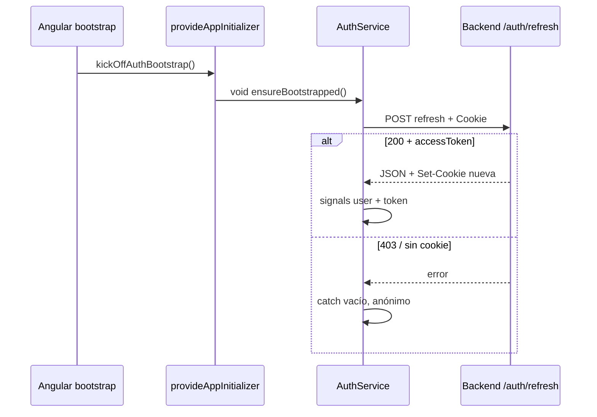
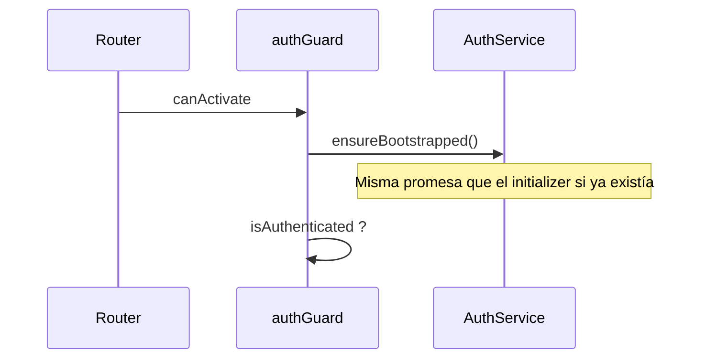
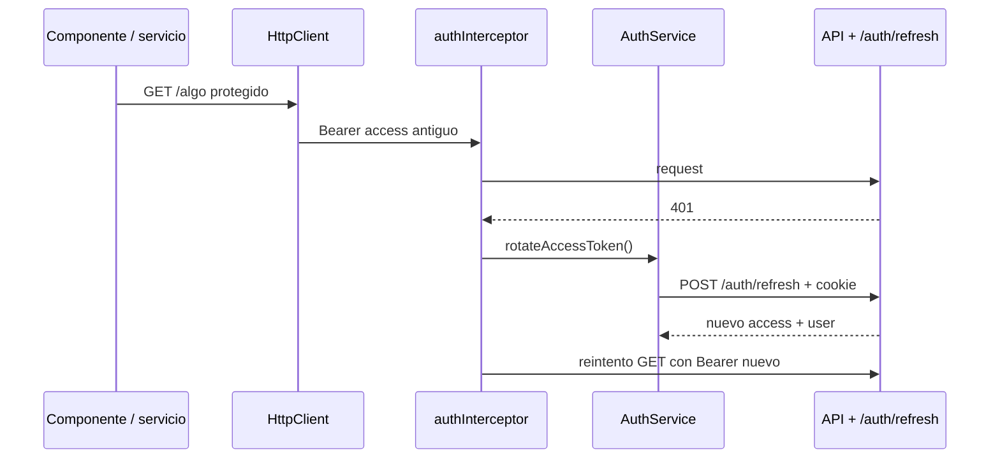

# Autenticación en el front (Iceplay)

Este documento describe **cómo está implementada** la autenticación en Angular y **cómo encaja** con el backend híbrido (JWT en JSON + refresh opaco en cookie httpOnly).

---

## 1. Visión general

| Pieza en el back | Qué hace el front |
|------------------|-------------------|
| **`accessToken`** (JWT en JSON) | Se guarda en **memoria** (`signal` en `AuthService`). Va en `Authorization: Bearer …` en casi todas las peticiones HTTP. |
| **Cookie `refreshToken`** (httpOnly, rotación en servidor) | El navegador la envía solo si las peticiones usan **`withCredentials: true`** y CORS lo permite. El front **nunca** lee el valor del refresh (no es accesible desde JS). |
| **`POST /auth/refresh`** | Devuelve nuevo `accessToken` + `user` y el servidor envía **`Set-Cookie`** con el nuevo refresh. |
| **`POST /auth/logout`** | Revoca refresh y limpia cookie; el front limpia memoria. |

**Principio:** el access token **no** se persiste en `localStorage` en este diseño; tras un F5, la sesión se recupera llamando a **`/auth/refresh`** con la cookie, no leyendo el JWT a mano.

---

## 2. Archivos involucrados

| Archivo | Rol |
|---------|-----|
| [`src/app/core/models/auth-api.model.ts`](../src/app/core/models/auth-api.model.ts) | Tipos TypeScript del JSON de login y refresh. |
| [`src/app/core/services/auth.service.ts`](../src/app/core/services/auth.service.ts) | Estado de sesión, login, logout, refresh, mapeo de usuario. |
| [`src/app/core/services/api.service.ts`](../src/app/core/services/api.service.ts) | Wrapper HTTP; `post()` acepta `{ withCredentials: true }` para rutas auth. |
| [`src/app/core/interceptors/auth.interceptor.ts`](../src/app/core/interceptors/auth.interceptor.ts) | Añade `Bearer` y maneja **401 → refresh → reintento**. |
| [`src/app/app.config.ts`](../src/app/app.config.ts) | `provideAppInitializer` que **arranca** el primer refresh en paralelo. |
| [`src/app/core/guards/auth.guard.ts`](../src/app/core/guards/auth.guard.ts) | Rutas protegidas: esperan el bootstrap antes de decidir. |
| [`src/app/core/guards/public.guard.ts`](../src/app/core/guards/public.guard.ts) | Rutas “solo invitados” (p. ej. login): mismo bootstrap para no redirigir mal tras F5. |

---

## 3. Contratos JSON (`auth-api.model.ts`)

### Login (`POST …/auth/login`)

```ts
interface AuthLoginResponse {
  user: unknown;
  accessToken?: string;
  token?: string; // JWT genérico; el back a veces envía ambos
}
```

El servicio usa **`accessToken ?? token`** como JWT de trabajo para APIs protegidas.

### Refresh (`POST …/auth/refresh`)

```ts
interface AuthRefreshResponse {
  user: unknown;
  accessToken: string;
}
```

Debe coincidir con lo que devuelve tu Express tras validar la cookie y rotar el refresh.

---

## 4. `AuthService` — detalle

### 4.1 Estado en memoria (signals)

- **`_accessToken`**: JWT actual para el interceptor.
- **`_currentUser`**: usuario mapeado al modelo `User` del front (nombre, rol, fechas, etc.).
- Los **computed** (`isAuthenticated`, `isAdmin`, `isSuperAdmin`, etc.) derivan de `_currentUser`.

### 4.2 `fetchRefreshAndApplySession()` (privado)

1. Llama a `api.post('auth/refresh', {}, { withCredentials: true })`.
2. Lee `accessToken` y `user` del JSON.
3. **`applySession(accessToken, user)`** → `mapUserFromBackend` + actualiza signals.

Si falta `accessToken` o la petición falla, **lanza** (quien llama decide si traga el error).

### 4.3 `ensureBootstrapped()` — “arranque” una vez por carga

- Crea **una sola promesa** (`bootstrapPromise`) por ciclo de vida de la pestaña.
- Esa promesa ejecuta `fetchRefreshAndApplySession().catch(() => { /* ignorar */ })`.
- **No relanza** error: sin cookie o 403 → usuario sigue anónimo.

**Para qué sirve:**

- Tras **F5**, recuperar sesión sin guardar JWT en disco.
- Que **guards** y el **initializer** compartan el **mismo** intento (no duplicar `refresh` al mismo tiempo por esa vía).

### 4.4 `rotateAccessToken()` — refresh por JWT caducado (401)

- Usa otro mutex (`rotatePromise`) para que **varias** peticiones que fallen a la vez con 401 **compartan** un solo `POST /auth/refresh`.
- Tras éxito, el servidor rota la cookie; el front solo actualiza `accessToken` + `user` en memoria.

**Diferencia con `ensureBootstrapped`:**

| Método | Cuándo | Mutex |
|--------|--------|--------|
| `ensureBootstrapped` | Primera sesión al cargar la app / guards | `bootstrapPromise` |
| `rotateAccessToken` | Interceptor ante **401** en API protegida | `rotatePromise` |

### 4.5 `mapUserFromBackend(raw)`

Unifica el usuario del back con el tipo `User`:

- `name` partido en `firstName` / `lastName` si no vienen sueltos.
- `role`: acepta `'admin' | 'super_admin'` o números (`mapRole`: 1 → super_admin, 2 → admin).
- Fechas `createdAt` / `lastLoginAt` como `Date`.

Así **login** y **refresh** dejan el mismo shape en el front.

### 4.6 `login()`

1. `POST auth/login` con **`withCredentials: true`** (para recibir `Set-Cookie: refreshToken`).
2. Toma `accessToken ?? token`.
3. `applySession` + **`bootstrapPromise = Promise.resolve()`** para marcar “ya hubo sesión” sin disparar otro refresh inmediato al pasar un guard.
4. Navega a `getDefaultRoute()`.

### 4.7 `logout()`

1. `POST auth/logout` con `withCredentials: true` (el back lee la cookie y revoca).
2. Limpia usuario y token en memoria.
3. **`bootstrapPromise` y `rotatePromise` a `null`** para que una nueva pestaña o nuevo login puedan volver a inicializar bien.
4. Navega a `/auth/login`.

---

## 5. Interceptor HTTP (`auth.interceptor.ts`)

### 5.1 Rutas que NO pasan por lógica de Bearer / 401→refresh

Regex sobre la URL completa:

```txt
/auth/login
/auth/refresh
/auth/logout
```

Para ellas se hace **`return next(req)`** sin inyectar aún `AuthService` en el flujo del interceptor (evita dependencias innecesarias y **ciclos** con el propio refresh).

### 5.2 Resto de peticiones

1. Si hay token en memoria → cabecera **`Authorization: Bearer <token>`**.
2. Si la respuesta es **401**:
   - Si el request ya lleva el contexto **`retriedAfterRefresh === true`** → se **repropaga** el error (evita bucles infinitos).
   - Si no → `rotateAccessToken()`, se lee el token nuevo y se **repite la petición una sola vez** con el contexto marcado.

### 5.3 `HttpContextToken` `retriedAfterRefresh`

Es un flag **por petición** (no viaja al servidor). Indica: “esta petición ya es el reintento tras refresh”. Si vuelve a ser 401, no se intenta otro refresh.

---

## 6. `app.config.ts` — initializer

```ts
function kickOffAuthBootstrap(): void {
  void inject(AuthService).ensureBootstrapped();
}
```

- La función **no devuelve** `Promise` → Angular **no bloquea** el bootstrap esperando al refresh (evita pantalla en blanco larga).
- Aun así, **en cuanto arranca la app** se dispara el primer intento de `refresh` en segundo plano.
- Los guards que hacen `from(ensureBootstrapped())` se **enganchan a la misma promesa** si ya se creó.

**Orden de providers:** `provideHttpClient` está registrado antes del initializer; `AuthService` → `ApiClient` resuelve cuando hace falta.

---

## 7. Guards

### `authGuard`

1. `from(auth.ensureBootstrapped())` — espera a que termine el primer refresh (éxito o fallo silencioso).
2. Si `isAuthenticated()` → permite la ruta.
3. Si no → `UrlTree` a `/auth/login`.

Así no rediriges a login **antes** de saber si la cookie devolvía sesión válida.

### `publicGuard`

Misma espera a `ensureBootstrapped()`, luego:

- Si **no** hay usuario → permite (p. ej. pantalla de login).
- Si hay usuario → redirige a `getDefaultRoute()` (no ver login estando ya logueado).

> En `app.routes.ts` puedes activar `canActivate: [publicGuard]` en rutas bajo `/auth` cuando quieras ese comportamiento.

---

## 8. Flujos (diagramas)

### 8.1 Primera carga o F5 (usuario ya había hecho login antes)



### 8.2 Navegación a ruta protegida (`authGuard`)



### 8.3 Access JWT caducado en una API



---

## 9. Checklist de entorno (imprescindible)

1. **CORS** en el back: `credentials: true` y `origin` del front en la lista permitida (`CORS_ORIGIN`).
2. **Cookie `refreshToken`**: mismo “site” que el front si usas `SameSite: 'strict'` (mismo dominio eTLD+1); si no, valorar `lax` en desarrollo entre subdominios.
3. **`withCredentials: true`** en todas las llamadas que deben llevar cookie **cross-origin** (aquí: login, refresh, logout vía `ApiService.post`).
4. **`baseUrl`** del front debe apuntar al origen que **setea** la cookie (mismo host/puerto que el API si la cookie es del API).
5. **Producción:** HTTPS + cookie `Secure` cuando corresponda.

---

## 10. Register vs login (back)

El **register** del back puede devolver otro paquete (p. ej. solo `token`) **sin** el mismo flujo de cookie `refreshToken` que el login. Este front **asume sesión “completa”** en **`login`**; tras register normalmente habrá que **iniciar sesión** o implementar otro flujo explícito si el back unifica respuestas.

---

## 11. Resumen en una frase

El front **guarda solo el access JWT en RAM**, **envía la cookie de refresh automáticamente** cuando usas `withCredentials` en auth, **rehidrata sesión al cargar** con `ensureBootstrapped`, y **renueva el access ante 401** con el interceptor llamando a `rotateAccessToken`.

---

*Última revisión alineada con el código en `src/app/core` y `app.config.ts`.*
